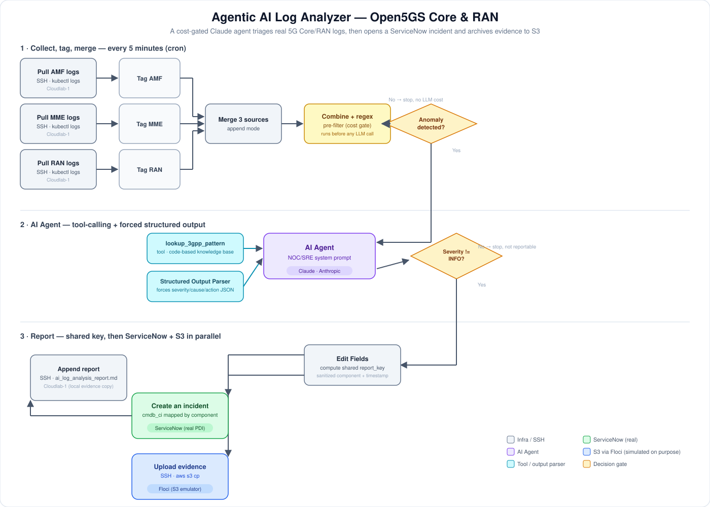

# Agentic AI Log Analyzer — Open5GS Core & RAN

An n8n workflow with a Claude-based AI Agent that watches a real 4G/5G Core (Open5GS) and RAN (srsRAN) for anomalies, triages them with tool-calling and structured output, and — only when it decides something is actually worth flagging — opens a ServiceNow incident and archives the evidence to S3. The agent never executes a fix; it recommends one and marks whether a human needs to approve it.



## Why this exists

Anyone can put "agentic AI experience" or "ServiceNow experience" on a resume — neither claim is checkable from the sentence alone. This project exists to make both checkable, by actually building the thing instead of describing it.

The operational problem behind it is real and not lab-specific: a live 4G/5G Core and RAN generate a constant stream of logs across every network function (AMF, MME, RAN), and the overwhelming majority of that stream is normal 3GPP signaling noise — Attach, Detach, idle-timer expiry — that looks alarming to a naive keyword search but means nothing. Watching that by hand doesn't scale past a handful of components, and running every log line through an LLM to find the signal is both slow and needlessly expensive at any real volume. This workflow is a NOC-copilot pattern built to solve exactly that: filter cheaply first, reason with an agent only when something looks genuinely anomalous, ground that reasoning in a real 3GPP knowledge base instead of letting the model guess, force a structured decision instead of a paragraph, and — critically — never let the agent act on its own. It recommends; a human approves.

A detection that never becomes an actionable, trackable incident is just a log line with extra steps. So the workflow doesn't stop at "here's an anomaly" — it opens a real ServiceNow incident, correctly linked via the CMDB to the specific network function that's affected, and archives the evidence next to it, so the loop actually closes: detect → reason → decide → escalate → prove it happened.

Both phases here were validated against the real Core/RAN of a personal 5G lab, not a synthetic scenario — because "I could build this" and "I built this, and here's exactly what broke while I did" are different claims, and only one of them is verifiable. The debugging log further down is the proof.

## Why this counts as "agentic," not just an LLM call

- **Tool-calling.** The agent has a `lookup_3gpp_pattern` tool it can invoke on its own before concluding, to check a finding against a small knowledge base of known Open5GS/srsRAN log patterns rather than guessing from the raw text alone.
- **Forced structured output.** An output parser requires the model to commit to `severity`, `component`, `probable_root_cause`, `recommended_action`, and a boolean `requires_human_approval` — not free text.
- **Human-in-the-loop by design, not by accident.** The system prompt explicitly tells the agent never to recommend executing a change itself. It only ever proposes and flags for approval.
- **A deliberate cost gate.** A cheap regex pre-filter runs *before* the agent, so routine 3GPP procedure logs (Attach, Detach, idle timers) never reach the LLM at all. Token spend only happens when something looks genuinely anomalous.
- **Grounded in real infrastructure, not a demo.** Every run pulls live `kubectl logs` output from a real Kubernetes-hosted Open5GS Core and srsRAN RAN, not synthetic or canned data.

## Infrastructure

| Host | Role |
|---|---|
| **Cloudlab-1** (`192.168.0.20`) | Runs the Kubernetes cluster hosting the Open5GS Core (AMF, MME) and srsRAN RAN, namespace `open5gs`. Already CPU-loaded from the rest of the lab. |
| **CloudSpartan** (`192.168.0.17`) | Separate Ubuntu laptop, chosen specifically so n8n and its workload don't compete with the cluster for CPU. Connects to Cloudlab-1 over SSH to run `kubectl logs` remotely — no architecture change was needed when n8n moved from being considered "on Cloudlab-1" to its own host, only pointing the SSH credential at the right target. Also runs Floci (see below). |

## How it works

```
[Cron, every 5 min]
        |
        v
[SSH: kubectl logs AMF] [SSH: kubectl logs MME] [SSH: kubectl logs RAN]
        |                       |                       |
        v                       v                       v
    [Tag AMF]               [Tag MME]               [Tag RAN]
        \_______________________|_______________________/
                                v
                   [Merge 3 sources — Append mode]
                                v
              [Combine + regex pre-filter (cost gate)]
                                v
                    Anomaly detected? --No--> (stop, no LLM cost)
                                |
                               Yes
                                v
              [AI Agent — Claude, via Anthropic Chat Model]
        (calls lookup_3gpp_pattern tool as needed, forced into
             a structured JSON output by an output parser)
                                v
                  Severity != INFO? --No--> (stop, not reportable)
                                |
                               Yes
                                v
        [Edit Fields — compute one shared, sanitized report_key]
                                v
                 ________________|________________
                |                                 |
                v                                 v
    [ServiceNow: create incident,       [SSH: write report to a temp
     mapped to the affected CI           file, then `aws s3 cp` it to
     via cmdb_ci]                        the Floci S3 endpoint]
                |
                v
    [SSH: append report to
     ai_log_analysis_report.md
     on Cloudlab-1]
```

The full, real n8n export is in [`workflow_export.json`](workflow_export.json) (credentials stripped — see Setup below).

## Setup

1. **n8n**, self-hosted via Docker, on a host separate from the cluster:
   ```bash
   docker run -it --rm --name n8n -p 5678:5678 \
     -e N8N_SECURE_COOKIE=false \
     -v n8n_data:/home/node/.n8n \
     docker.n8n.io/n8nio/n8n
   ```
   `N8N_SECURE_COOKIE=false` is required if you're accessing n8n over plain HTTP on a LAN IP rather than HTTPS — n8n refuses the login cookie otherwise.

2. **Credentials**, in n8n's Credentials panel:
   - **SSH (Password)** — pointed at the Kubernetes host, with `kubectl` already on that user's `PATH`. Reused across all four SSH nodes (the three log pulls and the report-append node).
   - **Anthropic API** — your API key, used by the "Anthropic Chat Model" node.
   - **ServiceNow (Basic Auth)** — see next step.

3. **ServiceNow.** A free Personal Developer Instance works fine (developer.servicenow.com). You'll need:
   - Basic Auth credentials for the instance.
   - Four Configuration Items in the CMDB — one per monitored component (AMF, MME, RAN) plus one representing the S3 bucket as a Cloud Storage resource — so incidents can be linked to *which* network function was affected, not just described in free text. Grab each CI's `sys_id` and hardcode it into the ternary expression on the "Create an incident" node's `cmdb_ci` field.

4. **S3-compatible storage for evidence**, without paying for real AWS: this repo uses [**Floci**](https://github.com/floci-project) (a local AWS API emulator, functionally equivalent to LocalStack), run via Docker on the same host as n8n, exposed on `192.168.0.17:4566`. Create the bucket once with the AWS CLI pointed at that endpoint:
   ```bash
   AWS_ENDPOINT_URL=http://192.168.0.17:4566 AWS_ACCESS_KEY_ID=test AWS_SECRET_ACCESS_KEY=test \
     aws s3 mb s3://open5gs-noc-reports --region us-east-1
   ```

5. **Import** `workflow_export.json` (Workflows → Import from File), reassign all four SSH nodes and the ServiceNow node to your own credentials, and reassign the Anthropic Chat Model node to your Anthropic credential. Activate the workflow.

## Honesty note: what's real and what's intentionally simulated

Real: the Kubernetes cluster, the log pulls, the agent's reasoning and tool-calling, the cost pre-filter, the ServiceNow instance and the incidents it creates, the CMDB modeling, and every bug listed below — all of it ran end-to-end against live infrastructure.

Simulated, on purpose: S3 is Floci, not AWS. This was a deliberate cost decision for a self-funded personal lab, not a limitation being hidden — the goal was to validate the *integration pattern* (write evidence, reference it consistently from the incident, retrieve it later) without paying an AWS bill for a homelab. If this is discussed in an interview or written up elsewhere, that distinction stays explicit: this is not "running in AWS production."

## A real debugging log

Everything below actually happened while building and running this, in roughly this order. It's included on purpose — the value of "I built an agentic workflow" is much stronger backed by "and here's exactly what broke and how I fixed it" than by an architecture diagram alone.

**Phase 1 — base workflow (2026-08-13):**

1. **Merge node stuck in "Combine" mode.** n8n's Merge node defaulted to a mode that requires matching fields across inputs, and it only recognized 2 of the 3 expected branches — the RAN branch was silently left unconnected. Fixed by switching the mode to "Append," setting the input count to 3, and reconnecting the missing branch by hand in the UI.
2. **`Could not get parameter "model.value"` on the Anthropic Chat Model node.** A schema mismatch between the hand-written JSON and the "resource locator" format the installed n8n version (2.34.5) expects for the Model field. Fixed by reselecting the model from the "From list" dropdown directly in the UI, which forces n8n to persist the parameter in the format it actually expects.
3. **First test runs found nothing.** With `--since=5m`, the pre-filter correctly found no anomalies in such a short window — which validated the cost-gate design (it really does skip the LLM call when there's nothing to see), but didn't exercise the agent. Widening to `--since=24h` was needed to reliably capture a real event.

**Phase 2 — ServiceNow + S3 extension (2026-08-14):**

4. **`=` prefix saved as a literal character.** In n8n fields where the Fixed/Expression toggle is visible, prefixing a value with `=` (n8n's expression marker) got saved as a literal `=` character instead of being evaluated — confirmed by a real ServiceNow incident that showed up with `"=WARNING..."` verbatim in its Short Description. In fields without that toggle, the same `=` prefix *was* required. Fixed field-by-field, by checking actual behavior rather than assuming consistency across the node.
5. **Heredoc broken by n8n's SSH node.** A `cat >> file << 'EOF' ... EOF` command failed with a bash `"here-document... wanted EOF"` error, because n8n's command field flattens real newlines into a single line before sending it over SSH. Fixed by rewriting the command as a single logical line using `printf '%s\n' ...` instead of a heredoc.
6. **AWS S3 node ignored its own custom endpoint.** n8n's native "AWS S3" node has a real, confirmed bug: it disregards the "Custom Endpoint" field on its credential and sends requests to real AWS regardless, which failed with a genuine `InvalidAccessKeyId` from AWS itself (not from Floci). Rather than fight the native node, the upload was rebuilt as an SSH ("Execute a command") node targeting a host with the AWS CLI already installed, running `aws s3 cp` directly against the Floci endpoint — the same SSH-based pattern already proven in the report-append node from Phase 1.
7. **A component name broke a file path.** In one real run, the agent extracted `component` as `"RAN-eNB / UE Simulator"` — with a space and a slash. Used verbatim in a file path, the slash was interpreted as a real subdirectory, breaking both the shell command (`Is a directory`) and `aws s3 cp` (`Unknown options`). Fixed by introducing the shared "Edit Fields" node, which computes one sanitized `report_key` (`.replace(/[^a-zA-Z0-9]+/g, '-')`) *before* the flow splits into the ServiceNow and S3 branches — so the S3 object key and the evidence reference inside the ServiceNow incident always match exactly, and neither can contain a character that breaks a shell command.

## Example run (real output, not illustrative)

From a run against `--since=1h` real logs on Cloudlab-1:

```json
{
  "severity": "WARNING",
  "component": "AMF",
  "event_summary": "AMF no pudo resolver el host 'lab-open5gs-scp-sbi' al arrancar, reintentó registro contra el NRF y se recuperó solo en ~21s.",
  "probable_root_cause": "Condición de carrera en el arranque: el pod de AMF llegó a estar Ready antes de que el Service DNS del SCP estuviera resoluble. No hubo impacto a usuarios.",
  "recommended_action": "Si el patrón se repite en cada restart, agregar un initContainer o readiness probe que espere al DNS del SCP. No urgente: se autorresuelve por retry/backoff.",
  "requires_human_approval": true
}
```

And from the full end-to-end run with the extended workflow (`--since=24h`), which produced a real ServiceNow incident and a real S3 object — see [`sample_run_log.md`](sample_run_log.md) for the complete output plus how it was independently verified (`aws s3 ls`, `aws s3 cp ... -`, and checking the incident directly in the ServiceNow instance).

What's notable in both cases: the agent correctly separated the one genuine anomaly from the normal 3GPP procedures surrounding it in the same log window (Attach, idle timers, RACH) — exactly the kind of domain judgment that a generic LLM without specialized context tends to get wrong.

## Design decisions worth discussing

- **Why a regex pre-filter runs before the LLM at all.** Every 5-minute cycle pulls logs whether or not anything is wrong. Sending all of that straight to Claude would mean paying for a model call on every single tick, most of which contain nothing but routine 3GPP procedure text. The pre-filter is a cheap, deterministic gate: only logs matching an anomaly-shaped regex ever reach the agent.
- **Why one shared node computes `report_key` before the fan-out.** Once the flow splits into a ServiceNow branch and an S3 branch, there's no way to guarantee they'd compute the same sanitized key independently — and a mismatch would mean the incident's evidence reference points at a filename that doesn't exist in S3. Computing it once, upstream of the split, makes that consistency structural rather than something to remember to keep in sync.
- **Why Floci instead of real AWS.** See the honesty note above — deliberate cost control on a self-funded lab, chosen to validate the integration pattern, not to imply a production AWS footprint.
- **Why SSH + CLI instead of native nodes, twice.** Both the log pulls and the S3 upload end up going through SSH `Execute Command` rather than a dedicated native n8n node. For the logs, there's no native "Kubernetes" node with the right shape; for S3, the native node turned out to have a real bug (see debugging log, item 6). In both cases, SSH-to-a-host-with-the-right-CLI-installed was the pragmatic, debuggable choice over fighting a node's abstraction.

## What this project deliberately does not cover

There's no retry/backoff logic if a ServiceNow or S3 call fails mid-run, no deduplication if the same anomaly is still present across consecutive 5-minute windows, and no automated remediation — by design, this workflow only ever recommends and flags for human approval. Adding any of these would be a reasonable next phase, not an oversight in this one.

## Related material

- [`sample_run_log.md`](sample_run_log.md) — full real output and independent verification steps.
